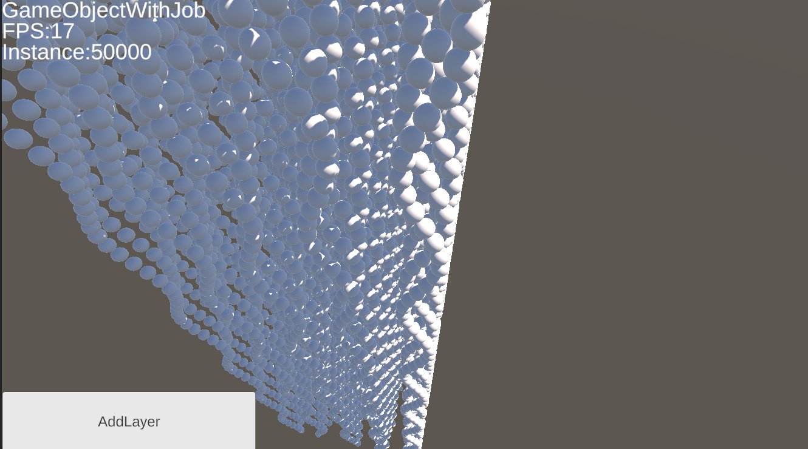

# Unity ECS 1.0.0-pre.65

## Introduction
This project is used to quickly how ECS works and how to do it. It is my personal experiences summarize. Some ideas I use simple ideas for understanding but might not be correct. If it works for you and me, the goal of the project is done.

## The Performance
> All GameObjects or entities are dynamic and driven by JobSystem for max performance 


## Explanation
#### Monobehavior
It is difficult to hold over 10000 game objects in MonoBehavior. we **opened the shadow** for each game object. The performance will be significantly dropped. MonoBehavior works on the main thread, each object will be executed linearly time. Even though we use JobSystem to move game objects, the performance was influenced by the rendering.


#### GPUInstance
GPU instance(`Graphics.RenderMeshInstanced`) is very fast and it is even faster than ECS, but each object **will not receive shadows**. GPU instance might be good for some game objects which contain baked light and no need for real-time lighting on runtime.


#### ECS
ECS has much better performance than MonoBehavior and each entity's rendering works the same as the Monobehavior game object. **Each entity is able to receive shadows**. There is no rendering difference between Entity and GameObjects from MonoBehavior.


## ECS Programming
ECS generates all game objects(entities) into another world I call "ECS World", the ECS world holds the same objects faster compare to MonoBehavior. In order to interact with the ECS world, we need to tell ecs, what data will be going inside, then ECS will manage the data with `data-oriented technology`.

### Bake Component
This step tells ECS what data will go inside the ECS world


#### Code Example

```CSharp
using Unity.Entities;
using Unity.Transforms;
using UnityEngine;
public class AuthoringData : MonoBehaviour
{
    public Vector3 position;
    public double speed;
}

public class DataBaker : Baker<AuthoringData>
{
    public override void Bake(AuthoringData authoring)
    {
        Entity _entity = this.GetEntity(authoring.gameObject, TransformUsageFlags.Dynamic);
        AddComponent(_entity, new AuthoringDataComponent
        {
            position = authoring.position,
            speed = authoring.speed,
        });
    }
}
public struct AuthoringDataComponent : IComponentData
{
    public Vector3 position;
    public double speed;
}


```
- In the previous codes, we bake `Vector3 position` and `double speed` into `AuthoringDataComponent`. `AuthoringDataComponent` is the data that can be recognized by the ECS world because it is from `IComponentData`, The C from ECS actually means Component.
- We build the connection between the ECS world and the game world(MonoBehavior world), if we modify `speed` from `AuthoringData` which can influence the ECS world

### Generate IAspect
IAspect is just for programmers to manage `Component`, for example, the previous example shows we had the Component which contains `position` and `speed`, what if we want to add `rotation` and `scale`? We can add them to the Component directly, but IAspect can help us expand the code easier, you can think of it as an `Interface` which helps us to manage code.


####Code Example

```CSharp
using System.Collections;
using System.Collections.Generic;
using TMPro;
using Unity.Entities;
using Unity.Mathematics;
using Unity.Transforms;
using UnityEngine;
public readonly partial struct ECSAspect : IAspect
{
    private readonly Entity _entity;
    private readonly RefRW<AuthoringDataComponent> _authoringData;
    private readonly RefRO<AuthoringTagComponent> _authoringTag;
    public LocalTransform SetPosition(double time, LocalTransform localTransform, Vector3 size)
    {
        int index = _authoringTag.ValueRO._id;
        int x = (int)(index % size.x);
        int y = (int)(index / size.x) % (int)size.y;
        int z = (int)(index / (size.x * size.y));
        localTransform = localTransform.WithPosition(new Vector3(x, y, z * 5 + Mathf.Sin((float)time + index)));
        return localTransform;
    }
}

```

### SystemBase

SystemBase is the ECS world's manager which can do update, modifications, queries, and all operations for the ECS world and for each entity.


####Code Example
```CSharp

using System.Collections;
using System.Collections.Generic;
using Unity.Entities;
using Unity.Mathematics;
using Unity.Transforms;
using UnityEngine;

public partial class ECSSystemBase : SystemBase
{
    int count = -1;
    int index = 0;
    protected override void OnUpdate()
    {
        //get the reference of the component
        RefRO<SpawnSpawnerComponent> authoringDataComponentRO = SystemAPI.GetSingletonRW<SpawnSpawnerComponent>();
        //don't run code if the openECS is false
        if (authoringDataComponentRO.ValueRO.openECS == false) return;

        //get the value from the component
        SpawnSpawnerComponent authoringDataComponent = SystemAPI.GetSingleton<SpawnSpawnerComponent>();
        Vector3 value = authoringDataComponentRO.ValueRO.size;


        EntityCommandBuffer ecb = SystemAPI.GetSingleton<EndSimulationEntityCommandBufferSystem.Singleton>().CreateCommandBuffer(World.Unmanaged);

        //give the count value
        if (count != (int)(value.x * value.y * value.z)) count = (int)(value.x * value.y * value.z);

        //generate the entity
        while (index != count)
        {
            // EntityManager.Instantiate(authoringDataComponent.entity);
            Entity entity = ecb.Instantiate(authoringDataComponent.entity);
            ecb.SetComponent(entity, new AuthoringTagComponent
            {
                _id = index
            });
            index++;
        }

        // find all entities with the ECSAspect and LocalTransform, you can modify the value
        Entities.ForEach((ref LocalTransform _localTransform, ref ECSAspect _ECSAspect) =>
        {
            _localTransform = _ECSAspect.SetPosition(SystemAPI.Time.ElapsedTime, _localTransform, authoringDataComponent.size);
        }).ScheduleParallel();
    }
}

```

# Project

## How to run ECS

- Select ECS

- Choice how many objects


## How to run others
- choice InstanceConfig and select the type of game object


